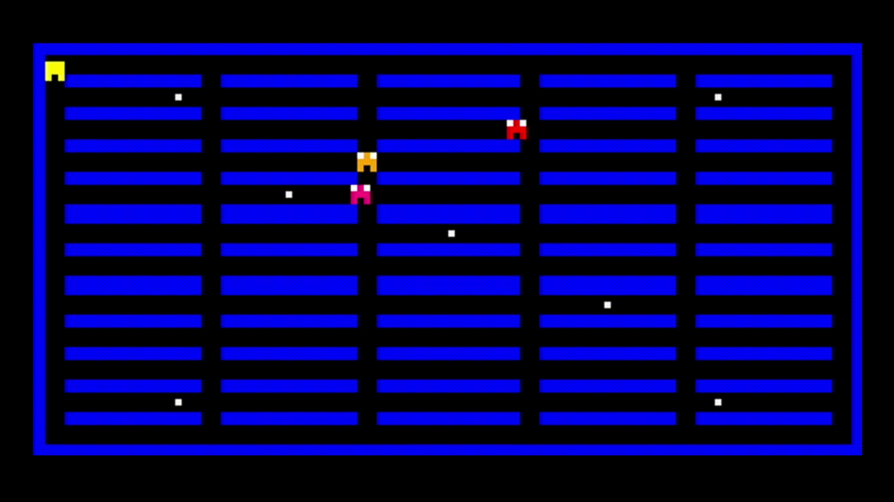

# 🟡 Pacman Clássico de 1980 em Assembly (MARS MIPS)



Recriação do **clássico jogo de 1980 do Pacman** desenvolvido utilizando **Assembly MIPS** na ferramenta **MARS**. O projeto tem como objetivo demonstrar a construção de um jogo completo em linguagem de baixo nível, explorando conceitos de movimentação, controle de estados, interação com o usuário e gerenciamento de fases.

### Status do Projeto: ✅ Concluído

<br>

## 📋 Sobre o Projeto

O **Pacman Clássico de 1980 em Assembly** é um projeto acadêmico desenvolvido para aplicar conceitos fundamentais da programação em baixo nível utilizando a arquitetura MIPS.

O jogo reproduz a experiência clássica do Pacman, onde o jogador deve percorrer um labirinto coletando todas as bolinhas disponíveis enquanto evita os fantasmas que circulam pelo mapa.

### Objetivo

Desenvolver um jogo funcional utilizando exclusivamente Assembly MIPS, colocando em prática conceitos de lógica computacional, controle de fluxo, manipulação de memória e interação com dispositivos de entrada e saída simulados.

### Problema Resolvido

Projetos de programação geralmente utilizam linguagens de alto nível, abstraindo diversos processos internos. Este projeto busca demonstrar como funcionalidades comuns de um jogo podem ser implementadas diretamente em uma linguagem de baixo nível, proporcionando uma compreensão mais profunda da arquitetura computacional.

<br>

## ✨ Funcionalidades

### Funcionalidades Implementadas

* [x] Movimentação do jogador utilizando teclado
* [x] Sistema de coleta de pontos
* [x] Duas fases jogáveis
* [x] Sistema de progressão entre fases
* [x] Três fantasmas por fase
* [x] Detecção de colisão com inimigos
* [x] Tela de vitória
* [x] Tela de derrota (Game Over)
* [x] Reinicialização automática da partida
* [x] Renderização gráfica utilizando Bitmap Display

<br>

## 🛠️ Tecnologias Utilizadas

### Ferramentas


* **MARS MIPS Simulator**
* **Java Runtime Environment (JRE)**

<br>

## 🏗️ Arquitetura do Projeto

O projeto segue uma arquitetura procedural típica de aplicações desenvolvidas em Assembly.

Características principais:

* Controle de fluxo por rótulos (labels)
* Manipulação direta de registradores
* Gerenciamento manual de estados do jogo
* Controle de entrada via MMIO
* Renderização gráfica utilizando Bitmap Display do MARS
* Estrutura baseada em rotinas e sub-rotinas

<br>

## 📂 Estrutura de Diretórios

```text
pacman-assembly-game/
│
├── src/                 # Código-fonte Assembly do jogo
│   └── pacman.asm       # Arquivo principal do projeto
│
├── docs/                # Documentação do projeto
│   └── pacman.gif       # Demonstração do jogo
│
└── README.md
```

<br>

## ⚙️ Pré-requisitos

Antes de iniciar, você precisará ter instalado:

* [Git (recomendado](https://git-scm.com/install//windows)
* [Java](https://www.java.com/pt-BR/)
* [MARS MIPS Simulator](https://github.com/dpetersanderson/MARS/) 

<br>

## 🚀 Como Executar

### 1. Clonar o Repositório

```bash
git clone https://github.com/DevJoaoVitorB/pacman-assembly-game.git
```

### 2. Abrir o Projeto no MARS

Carregue o arquivo `.asm` principal do projeto.

### 3. Configurar o Bitmap Display

No menu superior:

```text
Tools → Bitmap Display
# Esta será a tela onde o jogo será exibido
```

Configure:

```text
Unit Width in Pixels  = 4
Unit Height in Pixels = 4
```

Clique em:

```text
Connect to MIPS
```

### 5. Configurar o Teclado

No menu superior:

```text
Tools → Keyboard and Display MMIO Simulator
# Esta será a janela de entrada de comandos do jogador
```

Clique em:

```text
Connect to MIPS
```

### 6. Executar o Jogo

Clique em:

```text
Run → Assemble
Run → Go
```

### 7. Controles

```text
W → Mover para cima
A → Mover para esquerda
S → Mover para baixo
D → Mover para direita
```

O jogo inicia assim que o jogador realiza o primeiro movimento.

<br>

## 👨‍💻 Autor

| **DevJoaoVitorB** |
| ----------------- |
|  |
| [](https://github.com/DevJoaoVitorB) [](https://www.linkedin.com/in/devjoaovitorb) |
